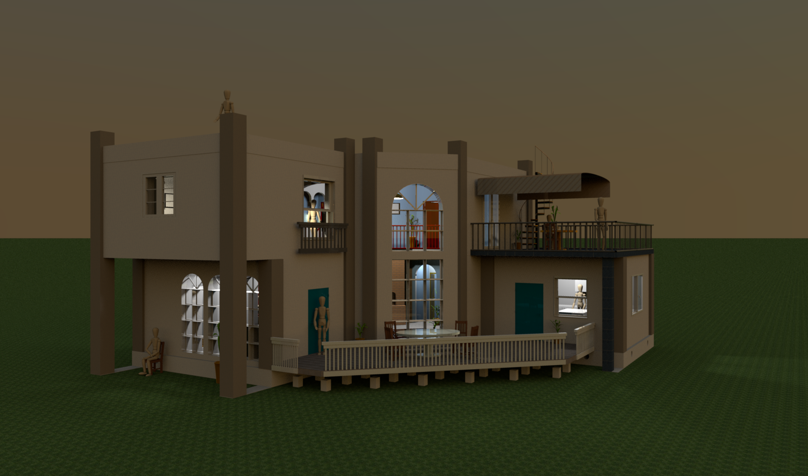

# Время суток 18:00
В это время дом приобретает **_КОРИЧНЕВЫЙ_** оттенок

## План просмотра.
сейчас на фото:
- [x] _вечер_

Так же для просмотра будут доступны следующие времена суток: 
- [ ] [_утро_](README0.md)
- [ ] [_день_](README1.md)
- [ ] [_ночь_](README3.md)

- [ ] [вернуться](README.md)